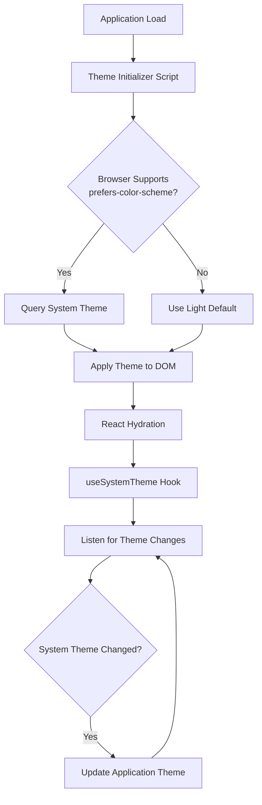

# Design Document: Theme Detection

## Overview

This feature implements automatic system theme detection using the `prefers-color-scheme` CSS media query. The system will detect the user's operating system or browser theme preference (dark or light) on application load and respond to real-time changes without requiring page refreshes.

The implementation leverages the existing theme infrastructure (`data-theme` attribute, CSS variables, Tailwind dark mode) and extends it with system preference detection. The design prioritizes performance, avoiding theme flashing during initial load, and maintaining backward compatibility with the existing manual theme toggle functionality.

### Key Design Decisions

1. **Media Query API**: Use `window.matchMedia('(prefers-color-scheme: dark)')` for detection and listening
2. **Initialization Timing**: Detect and apply theme before React hydration to prevent flash
3. **Priority Order**: System preference → localStorage → default (light)
4. **Graceful Degradation**: Fall back to light theme if API unavailable
5. **Coexistence**: System detection works alongside manual theme toggle

## Architecture

### Component Interaction



### Data Flow

1. **Initial Load**: Inline script → System query → DOM attribute → CSS variables
2. **Runtime Updates**: Media query listener → React state → DOM attribute → CSS variables
3. **Manual Override**: User toggle → localStorage → React state → DOM attribute

## Components and Interfaces

### 1. Theme Initializer Script (Inline)

**Purpose**: Detect and apply system theme before first render to prevent flash.

**Location**: `index.html` (inline `<script>` in `<head>`)

**Implementation**:
```typescript
// Inline script (no imports, vanilla JS)
(function() {
  try {
    const mediaQuery = window.matchMedia('(prefers-color-scheme: dark)');
    const systemTheme = mediaQuery.matches ? 'dark' : 'light';
    const storedTheme = localStorage.getItem('gg-theme');
    const theme = storedTheme || systemTheme;
    document.documentElement.setAttribute('data-theme', theme);
  } catch (e) {
    // Fallback to light if API unavailable
    document.documentElement.setAttribute('data-theme', 'light');
    console.warn('System theme detection unavailable:', e);
  }
})();
```

**Rationale**: Inline script executes synchronously before page render, preventing theme flash. Must be vanilla JS (no React/imports) to run before bundle loads.

### 2. useSystemTheme Hook

**Purpose**: Provide system theme detection and real-time change listening for React components.

**Location**: `src/hooks/useSystemTheme.ts`

**Interface**:
```typescript
interface UseSystemThemeReturn {
  systemTheme: 'light' | 'dark' | null;
  isSupported: boolean;
}

function useSystemTheme(): UseSystemThemeReturn
```

**Behavior**:
- Returns current system theme preference
- Returns `null` if API unsupported
- Sets up media query listener on mount
- Cleans up listener on unmount
- Updates state when system theme changes

**Implementation Strategy**:
```typescript
export function useSystemTheme(): UseSystemThemeReturn {
  const [systemTheme, setSystemTheme] = useState<'light' | 'dark' | null>(() => {
    if (!window.matchMedia) return null;
    return window.matchMedia('(prefers-color-scheme: dark)').matches ? 'dark' : 'light';
  });

  const [isSupported] = useState(() => {
    return typeof window !== 'undefined' && 
           typeof window.matchMedia === 'function';
  });

  useEffect(() => {
    if (!isSupported) return;

    const mediaQuery = window.matchMedia('(prefers-color-scheme: dark)');
    
    const handleChange = (e: MediaQueryListEvent) => {
      setSystemTheme(e.matches ? 'dark' : 'light');
    };

    mediaQuery.addEventListener('change', handleChange);
    return () => mediaQuery.removeEventListener('change', handleChange);
  }, [isSupported]);

  return { systemTheme, isSupported };
}
```

### 3. Enhanced useTheme Hook

**Purpose**: Integrate system theme detection with existing theme management.

**Location**: `src/hooks/useTheme.ts` (modify existing)

**Interface**:
```typescript
interface UseThemeOptions {
  followSystem?: boolean;  // New option
  dbTheme?: 'light' | 'dark' | null;
}

interface UseThemeReturn {
  theme: 'light' | 'dark';
  setTheme: (theme: 'light' | 'dark') => void;
  toggle: () => void;
  isSystemTheme: boolean;  // New property
}

function useTheme(options?: UseThemeOptions): UseThemeReturn
```

**Behavior**:
- If `followSystem: true`, sync with system theme changes
- Manual `setTheme` call disables system following (stores preference)
- `isSystemTheme` indicates if currently following system
- Maintains backward compatibility (default behavior unchanged)

### 4. ThemeProvider Context (Optional Enhancement)

**Purpose**: Centralize theme state management across the application.

**Location**: `src/contexts/ThemeContext.tsx`

**Interface**:
```typescript
interface ThemeContextValue {
  theme: 'light' | 'dark';
  systemTheme: 'light' | 'dark' | null;
  setTheme: (theme: 'light' | 'dark') => void;
  followSystem: boolean;
  setFollowSystem: (follow: boolean) => void;
  toggle: () => void;
}

function ThemeProvider({ children }: { children: ReactNode }): JSX.Element
function useThemeContext(): ThemeContextValue
```

**Rationale**: Provides single source of truth for theme state, avoiding prop drilling and ensuring consistency across components.

## Data Models

### Theme State

```typescript
type Theme = 'light' | 'dark';

interface ThemeState {
  // Current active theme
  current: Theme;
  
  // System preference (null if unsupported)
  system: Theme | null;
  
  // User's manual preference (null if following system)
  userPreference: Theme | null;
  
  // Whether system detection is supported
  isSystemSupported: boolean;
}
```

### LocalStorage Schema

```typescript
// Key: 'gg-theme'
// Value: 'light' | 'dark' | null
// null = follow system (remove key)
// 'light' | 'dark' = user preference (override system)
```

**Migration**: Existing localStorage values remain valid. No migration needed.

## Correctness Properties

*A property is a characteristic or behavior that should hold true across all valid executions of a system—essentially, a formal statement about what the system should do. Properties serve as the bridge between human-readable specifications and machine-verifiable correctness guarantees.*


### Property 1: System Theme Synchronization

*For any* system theme preference (dark or light), when the system theme is detected, the application theme should match the system preference.

**Validates: Requirements 1.2, 1.3**

### Property 2: Theme Change Event Handling

*For any* system theme change event (light→dark or dark→light), when the event occurs, the application theme should update to match the new system preference.

**Validates: Requirements 2.1, 2.2, 2.3**

### Property 3: DOM State Consistency

*For any* theme value (light or dark), when the theme is applied, the `data-theme` attribute on `document.documentElement` should match the theme value and all CSS variables should reflect the correct theme colors.

**Validates: Requirements 3.1, 3.2, 3.3**

### Property 4: Initialization Before Render

*For any* application load, the `data-theme` attribute and corresponding CSS variables should be set on `document.documentElement` before the first React component renders.

**Validates: Requirements 5.1, 5.3**

## Error Handling

### Unsupported Browser Detection

**Scenario**: Browser doesn't support `window.matchMedia` or `prefers-color-scheme`

**Handling**:
1. Detect support using feature detection: `typeof window.matchMedia === 'function'`
2. If unsupported, set `isSupported: false` in hook
3. Fall back to light theme as default
4. Log warning to console: `console.warn('System theme detection unavailable')`
5. Continue normal operation with manual theme toggle available

**Code Example**:
```typescript
try {
  const mediaQuery = window.matchMedia('(prefers-color-scheme: dark)');
  // ... normal flow
} catch (error) {
  console.warn('System theme detection unavailable:', error);
  document.documentElement.setAttribute('data-theme', 'light');
}
```

### Media Query Listener Errors

**Scenario**: Error occurs in media query change listener

**Handling**:
1. Wrap listener callback in try-catch
2. Log error to console
3. Maintain current theme (don't crash)
4. Continue listening for future events

**Code Example**:
```typescript
const handleChange = (e: MediaQueryListEvent) => {
  try {
    setSystemTheme(e.matches ? 'dark' : 'light');
  } catch (error) {
    console.error('Error handling theme change:', error);
  }
};
```

### LocalStorage Access Errors

**Scenario**: localStorage unavailable (private browsing, permissions)

**Handling**:
1. Wrap localStorage calls in try-catch
2. If read fails, proceed with system theme or default
3. If write fails, log warning but continue (theme still works in memory)
4. Gracefully degrade to session-only theme persistence

**Code Example**:
```typescript
try {
  const stored = localStorage.getItem('gg-theme');
  return stored as Theme;
} catch (error) {
  console.warn('localStorage unavailable, using system theme');
  return null;
}
```

### SSR/Node Environment

**Scenario**: Code runs in Node.js environment (SSR, testing)

**Handling**:
1. Check for `window` existence before accessing
2. Return `null` for system theme in SSR
3. Hydrate with correct theme on client
4. Use `typeof window !== 'undefined'` guards

**Code Example**:
```typescript
const [systemTheme, setSystemTheme] = useState<Theme | null>(() => {
  if (typeof window === 'undefined') return null;
  if (!window.matchMedia) return null;
  return window.matchMedia('(prefers-color-scheme: dark)').matches ? 'dark' : 'light';
});
```

## Testing Strategy

### Unit Testing Approach

The testing strategy uses a dual approach combining unit tests for specific scenarios and property-based tests for universal behaviors.

**Unit Tests** focus on:
- Specific examples of theme detection (light, dark)
- Edge cases (unsupported browsers, localStorage errors)
- Integration points (DOM updates, event listeners)
- Error conditions (API unavailable, listener failures)

**Property-Based Tests** focus on:
- Universal properties that hold for all theme values
- State transitions and consistency
- Idempotent operations (applying same theme twice)

### Testing Framework

**Framework**: Vitest (already in project)
**Property Testing Library**: fast-check (recommended for TypeScript/React)

**Installation**:
```bash
npm install --save-dev fast-check
```

**Configuration**: Each property test should run minimum 100 iterations to ensure comprehensive coverage through randomization.

### Test Structure

#### 1. Unit Tests for useSystemTheme Hook

**File**: `src/hooks/useSystemTheme.test.ts`

**Test Cases**:
- Returns 'dark' when system prefers dark mode
- Returns 'light' when system prefers light mode
- Returns null when matchMedia unsupported
- Sets isSupported to false when API unavailable
- Adds event listener on mount
- Removes event listener on unmount
- Updates state when system theme changes
- Handles listener errors gracefully

**Example**:
```typescript
describe('useSystemTheme', () => {
  it('returns dark when system prefers dark mode', () => {
    const mockMatchMedia = vi.fn().mockReturnValue({
      matches: true,
      addEventListener: vi.fn(),
      removeEventListener: vi.fn(),
    });
    window.matchMedia = mockMatchMedia;
    
    const { result } = renderHook(() => useSystemTheme());
    
    expect(result.current.systemTheme).toBe('dark');
    expect(result.current.isSupported).toBe(true);
  });
});
```

#### 2. Unit Tests for Theme Initializer

**File**: `src/__tests__/theme-initializer.test.ts`

**Test Cases**:
- Sets data-theme attribute on document element
- Uses system theme when no localStorage value
- Prefers localStorage over system theme
- Falls back to light when API unsupported
- Logs warning when detection unavailable
- Executes synchronously (no async operations)

**Example**:
```typescript
describe('Theme Initializer', () => {
  it('falls back to light when matchMedia unsupported', () => {
    delete (window as any).matchMedia;
    const consoleWarnSpy = vi.spyOn(console, 'warn');
    
    // Execute initializer script
    eval(initializerScript);
    
    expect(document.documentElement.getAttribute('data-theme')).toBe('light');
    expect(consoleWarnSpy).toHaveBeenCalled();
  });
});
```

#### 3. Property-Based Tests

**File**: `src/hooks/__tests__/theme.properties.test.ts`

**Property 1: System Theme Synchronization**
```typescript
import fc from 'fast-check';

describe('Property: System Theme Synchronization', () => {
  it('application theme matches system preference', () => {
    // Feature: theme-detection, Property 1: For any system theme preference (dark or light), when the system theme is detected, the application theme should match the system preference
    
    fc.assert(
      fc.property(
        fc.constantFrom('dark', 'light'),
        (systemTheme) => {
          // Setup: Mock matchMedia to return systemTheme
          const mockMatchMedia = vi.fn().mockReturnValue({
            matches: systemTheme === 'dark',
            addEventListener: vi.fn(),
            removeEventListener: vi.fn(),
          });
          window.matchMedia = mockMatchMedia;
          
          // Execute: Detect system theme
          const { result } = renderHook(() => useSystemTheme());
          
          // Verify: Application theme matches system
          expect(result.current.systemTheme).toBe(systemTheme);
        }
      ),
      { numRuns: 100 }
    );
  });
});
```

**Property 2: Theme Change Event Handling**
```typescript
describe('Property: Theme Change Event Handling', () => {
  it('application theme updates on system theme change', () => {
    // Feature: theme-detection, Property 2: For any system theme change event, when the event occurs, the application theme should update to match the new system preference
    
    fc.assert(
      fc.property(
        fc.constantFrom('dark', 'light'),
        fc.constantFrom('dark', 'light'),
        (initialTheme, newTheme) => {
          let listener: ((e: MediaQueryListEvent) => void) | null = null;
          
          const mockMatchMedia = vi.fn().mockReturnValue({
            matches: initialTheme === 'dark',
            addEventListener: vi.fn((_, cb) => { listener = cb; }),
            removeEventListener: vi.fn(),
          });
          window.matchMedia = mockMatchMedia;
          
          const { result } = renderHook(() => useSystemTheme());
          
          // Simulate theme change event
          if (listener) {
            listener({ matches: newTheme === 'dark' } as MediaQueryListEvent);
          }
          
          // Verify: Theme updated
          expect(result.current.systemTheme).toBe(newTheme);
        }
      ),
      { numRuns: 100 }
    );
  });
});
```

**Property 3: DOM State Consistency**
```typescript
describe('Property: DOM State Consistency', () => {
  it('data-theme attribute matches applied theme', () => {
    // Feature: theme-detection, Property 3: For any theme value, when the theme is applied, the data-theme attribute should match the theme value
    
    fc.assert(
      fc.property(
        fc.constantFrom('dark', 'light'),
        (theme) => {
          // Apply theme
          document.documentElement.setAttribute('data-theme', theme);
          
          // Verify: Attribute matches
          expect(document.documentElement.getAttribute('data-theme')).toBe(theme);
          
          // Verify: CSS variables are defined
          const styles = getComputedStyle(document.documentElement);
          const bgColor = styles.getPropertyValue('--color-bg');
          expect(bgColor).toBeTruthy();
        }
      ),
      { numRuns: 100 }
    );
  });
});
```

**Property 4: Initialization Before Render**
```typescript
describe('Property: Initialization Before Render', () => {
  it('theme attribute set before React renders', () => {
    // Feature: theme-detection, Property 4: For any application load, the data-theme attribute should be set before first React component renders
    
    fc.assert(
      fc.property(
        fc.constantFrom('dark', 'light'),
        (systemTheme) => {
          // Simulate fresh page load
          document.documentElement.removeAttribute('data-theme');
          
          // Mock system theme
          window.matchMedia = vi.fn().mockReturnValue({
            matches: systemTheme === 'dark',
          });
          
          // Execute initializer (synchronous)
          eval(initializerScript);
          
          // Verify: Attribute set before any React code runs
          expect(document.documentElement.getAttribute('data-theme')).toBeTruthy();
        }
      ),
      { numRuns: 100 }
    );
  });
});
```

#### 4. Integration Tests

**File**: `src/__tests__/theme-integration.test.tsx`

**Test Cases**:
- Theme persists across page reloads
- Manual theme toggle overrides system preference
- System theme changes reflected in UI
- Theme works with existing components (AppShell, etc.)
- No theme flash on initial load

**Example**:
```typescript
describe('Theme Integration', () => {
  it('manual toggle overrides system preference', () => {
    // Setup: System prefers dark
    window.matchMedia = vi.fn().mockReturnValue({
      matches: true,
      addEventListener: vi.fn(),
      removeEventListener: vi.fn(),
    });
    
    const { result } = renderHook(() => useTheme({ followSystem: true }));
    
    expect(result.current.theme).toBe('dark');
    
    // User manually sets light
    act(() => {
      result.current.setTheme('light');
    });
    
    expect(result.current.theme).toBe('light');
    expect(result.current.isSystemTheme).toBe(false);
  });
});
```

### Edge Case Testing

**Edge Cases to Cover**:
1. Browser without matchMedia support (IE11, old browsers)
2. localStorage disabled (private browsing)
3. Rapid theme changes (debouncing not needed, but verify stability)
4. SSR environment (Node.js, no window object)
5. Media query listener errors
6. Initial load with no system preference (rare, but possible)

### Test Coverage Goals

- **Line Coverage**: >90%
- **Branch Coverage**: >85%
- **Property Tests**: 100 iterations minimum per property
- **Edge Cases**: All identified edge cases covered

### Continuous Integration

**Pre-commit**: Run unit tests
**CI Pipeline**: Run all tests including property tests
**Coverage Report**: Generate and track coverage trends

## Implementation Notes

### Performance Considerations

1. **Inline Script Size**: Keep initializer script minimal (<1KB) to avoid blocking page load
2. **Event Listener**: Single listener per application instance (cleanup on unmount)
3. **State Updates**: Batch DOM updates to avoid layout thrashing
4. **CSS Variables**: Leverage CSS cascade for efficient theme application

### Browser Compatibility

**Supported**:
- Chrome 76+ (2019)
- Firefox 67+ (2019)
- Safari 12.1+ (2019)
- Edge 79+ (2020)

**Unsupported** (graceful degradation):
- IE11 and below
- Older mobile browsers

**Detection Method**:
```typescript
const isSupported = typeof window !== 'undefined' && 
                   typeof window.matchMedia === 'function' &&
                   window.matchMedia('(prefers-color-scheme: dark)').media !== 'not all';
```

### Migration Path

**Existing Users**:
1. Users with stored theme preference: Preference preserved, system detection inactive
2. Users without preference: System detection activates automatically
3. No breaking changes to existing theme toggle functionality

**Database Schema**: No changes needed. The `dark_mode` field in user profiles remains for manual preference storage.

### Future Enhancements

1. **Theme Scheduling**: Auto-switch based on time of day
2. **Custom Themes**: Support for more than light/dark
3. **Per-Component Themes**: Allow components to override global theme
4. **Theme Transitions**: Smooth CSS transitions between themes
5. **Accessibility**: High contrast mode detection via `prefers-contrast`

## Dependencies

### External Libraries

- **fast-check**: Property-based testing library
  - Version: ^3.15.0
  - Purpose: Generate random test inputs for property tests
  - Installation: `npm install --save-dev fast-check`

### Browser APIs

- **window.matchMedia**: System theme detection
  - Fallback: Light theme default
  - Polyfill: Not recommended (adds complexity, limited benefit)

### Internal Dependencies

- Existing `useTheme` hook (modify)
- Tailwind CSS dark mode configuration (no changes)
- CSS variables in `colors.css` (no changes)
- `data-theme` attribute system (no changes)

## Security Considerations

### Privacy

- **No Tracking**: System theme preference not sent to servers
- **Local Only**: Theme detection happens entirely client-side
- **No PII**: Theme preference contains no personally identifiable information

### XSS Prevention

- **Sanitization**: Theme values restricted to 'light' | 'dark' enum
- **No User Input**: Theme values not derived from user-controlled input
- **DOM Safety**: setAttribute with validated values only

### Content Security Policy

- **Inline Script**: Initializer script requires `script-src 'unsafe-inline'` or nonce
- **Recommendation**: Use nonce-based CSP for production
- **Example**: `<script nonce="${nonce}">...</script>`

## Accessibility

### Screen Readers

- Theme changes don't affect screen reader functionality
- No ARIA announcements needed (visual change only)
- Maintain color contrast ratios in both themes

### Keyboard Navigation

- Theme detection doesn't interfere with keyboard navigation
- Manual toggle remains keyboard accessible
- Focus indicators visible in both themes

### Color Contrast

- **WCAG AA Compliance**: Both themes meet 4.5:1 contrast ratio
- **Verification**: Test with contrast checker tools
- **Dark Mode**: Ensure sufficient contrast for text on dark backgrounds

## Rollout Plan

### Phase 1: Implementation (Week 1)
1. Create `useSystemTheme` hook
2. Add inline initializer script to `index.html`
3. Modify `useTheme` hook for system integration
4. Write unit tests

### Phase 2: Testing (Week 1-2)
1. Write property-based tests
2. Integration testing with existing components
3. Cross-browser testing
4. Performance testing

### Phase 3: Documentation (Week 2)
1. Update component documentation
2. Add usage examples
3. Document migration path
4. Create troubleshooting guide

### Phase 4: Deployment (Week 2)
1. Deploy to staging environment
2. QA testing
3. Production deployment
4. Monitor for issues

### Success Metrics

- **Adoption**: % of users with system theme active
- **Performance**: Theme detection time <100ms
- **Errors**: <0.1% error rate in theme detection
- **User Feedback**: Positive sentiment on theme experience

## Appendix

### Research References

1. **MDN Web Docs**: `prefers-color-scheme` media query
   - https://developer.mozilla.org/en-US/docs/Web/CSS/@media/prefers-color-scheme

2. **Can I Use**: Browser compatibility data
   - https://caniuse.com/prefers-color-scheme

3. **Web.dev**: Best practices for dark mode
   - https://web.dev/prefers-color-scheme/

4. **React Documentation**: useEffect for event listeners
   - https://react.dev/reference/react/useEffect

5. **Tailwind CSS**: Dark mode configuration
   - https://tailwindcss.com/docs/dark-mode

### Code Examples

#### Complete useSystemTheme Implementation

```typescript
import { useState, useEffect } from 'react';

export type Theme = 'light' | 'dark';

export interface UseSystemThemeReturn {
  systemTheme: Theme | null;
  isSupported: boolean;
}

export function useSystemTheme(): UseSystemThemeReturn {
  const [systemTheme, setSystemTheme] = useState<Theme | null>(() => {
    if (typeof window === 'undefined') return null;
    if (!window.matchMedia) return null;
    
    try {
      const mediaQuery = window.matchMedia('(prefers-color-scheme: dark)');
      return mediaQuery.matches ? 'dark' : 'light';
    } catch (error) {
      console.warn('Error detecting system theme:', error);
      return null;
    }
  });

  const [isSupported] = useState(() => {
    return typeof window !== 'undefined' && 
           typeof window.matchMedia === 'function';
  });

  useEffect(() => {
    if (!isSupported) return;

    try {
      const mediaQuery = window.matchMedia('(prefers-color-scheme: dark)');
      
      const handleChange = (e: MediaQueryListEvent) => {
        try {
          setSystemTheme(e.matches ? 'dark' : 'light');
        } catch (error) {
          console.error('Error handling theme change:', error);
        }
      };

      mediaQuery.addEventListener('change', handleChange);
      return () => mediaQuery.removeEventListener('change', handleChange);
    } catch (error) {
      console.error('Error setting up theme listener:', error);
    }
  }, [isSupported]);

  return { systemTheme, isSupported };
}
```

#### Enhanced useTheme with System Integration

```typescript
import { useState, useEffect } from 'react';
import { useSystemTheme, type Theme } from './useSystemTheme';

export interface UseThemeOptions {
  followSystem?: boolean;
  dbTheme?: Theme | null;
}

export interface UseThemeReturn {
  theme: Theme;
  setTheme: (theme: Theme) => void;
  toggle: () => void;
  isSystemTheme: boolean;
}

export function useTheme(options: UseThemeOptions = {}): UseThemeReturn {
  const { followSystem = false, dbTheme } = options;
  const { systemTheme } = useSystemTheme();

  const [theme, setThemeState] = useState<Theme>(() => {
    // Priority: dbTheme > localStorage > system > default
    if (dbTheme) return dbTheme;
    
    try {
      const stored = localStorage.getItem('gg-theme') as Theme | null;
      if (stored) return stored;
    } catch (error) {
      console.warn('localStorage unavailable:', error);
    }
    
    if (followSystem && systemTheme) return systemTheme;
    return 'light';
  });

  const [isSystemTheme, setIsSystemTheme] = useState(() => {
    return followSystem && !dbTheme && !localStorage.getItem('gg-theme');
  });

  // Sync with system theme if following
  useEffect(() => {
    if (followSystem && isSystemTheme && systemTheme) {
      setThemeState(systemTheme);
    }
  }, [followSystem, isSystemTheme, systemTheme]);

  // Sync with database theme
  useEffect(() => {
    if (dbTheme) {
      setThemeState(dbTheme);
      setIsSystemTheme(false);
    }
  }, [dbTheme]);

  // Apply theme to DOM
  useEffect(() => {
    document.documentElement.setAttribute('data-theme', theme);
    
    if (!isSystemTheme) {
      try {
        localStorage.setItem('gg-theme', theme);
      } catch (error) {
        console.warn('Failed to save theme preference:', error);
      }
    }
  }, [theme, isSystemTheme]);

  const setTheme = (newTheme: Theme) => {
    setThemeState(newTheme);
    setIsSystemTheme(false); // Manual override disables system following
  };

  const toggle = () => {
    setTheme(theme === 'light' ? 'dark' : 'light');
  };

  return { theme, setTheme, toggle, isSystemTheme };
}
```

#### Inline Initializer Script for index.html

```html
<!DOCTYPE html>
<html lang="en">
  <head>
    <meta charset="UTF-8" />
    <meta name="viewport" content="width=device-width, initial-scale=1.0" />
    <title>GotGetGo</title>
    
    <!-- Theme Initializer: Must run before any rendering -->
    <script>
      (function() {
        try {
          // Check for stored preference first
          var stored = localStorage.getItem('gg-theme');
          if (stored === 'light' || stored === 'dark') {
            document.documentElement.setAttribute('data-theme', stored);
            return;
          }
          
          // Fall back to system preference
          if (window.matchMedia) {
            var darkQuery = window.matchMedia('(prefers-color-scheme: dark)');
            var theme = darkQuery.matches ? 'dark' : 'light';
            document.documentElement.setAttribute('data-theme', theme);
          } else {
            // Fallback for unsupported browsers
            document.documentElement.setAttribute('data-theme', 'light');
            console.warn('System theme detection unavailable, using light theme');
          }
        } catch (e) {
          // Fail gracefully
          document.documentElement.setAttribute('data-theme', 'light');
          console.warn('Theme initialization error:', e);
        }
      })();
    </script>
    
    <!-- Rest of head content -->
  </head>
  <body>
    <div id="root"></div>
    <script type="module" src="/src/main.tsx"></script>
  </body>
</html>
```
